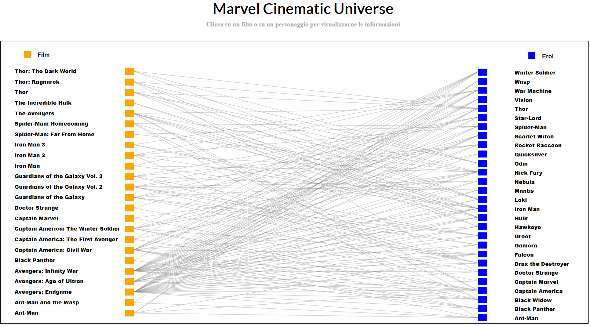
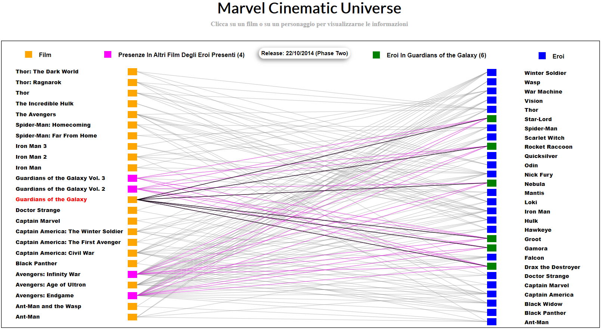
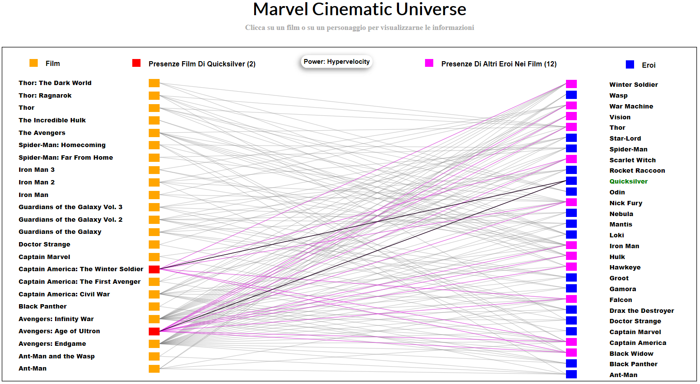
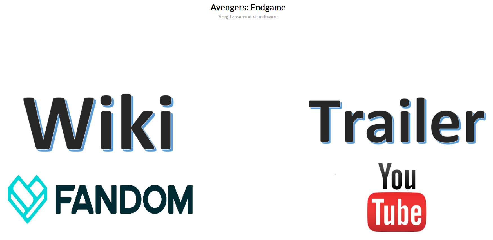
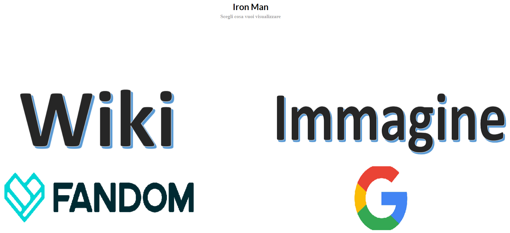

# Progetto-Finale-InfoVis-A.A.2018-2019 - Esplorazione Visuale del Marvel Cinematic Universe 
Progetto Finale per il corso di Visualizzazione delle Informazioni, Università Roma Tre, a.a. 2018-2019.

## Indice dei contenuti

- [Specifica del progetto](#specifica-del-progetto)
- [Riferimenti](#riferimenti)
- [Funzionalità Progettuali](#funzionalità-progettuali)
- [Caricamento dati da file esterno](#caricamento-dati-da-file-esterno)
- [Versione utilizzata](#versione-utilizzata)
- [Autore](#autore)
- [Anteprime grafiche](#anteprime-grafiche)

## Specifica del progetto

Creazione di un sistema di visualizzazione per il Grafo del Marvel Cinematic Unviverse che permetta una visione snella, intuitiva ed efficace delle informazioni presenti nei dati, in particolare le numerose relazioni tra Eroi e Film.

## Riferimenti

<i>
The Marvel Cinematic Universe is a media franchise and shared universe that is centered on a series of superhero films, based on characters that appear in comic books published by Marvel. The data set describes a selection of 28 characters (heroes) and in which of the 24 movies released so far they appeared. The data was compiled from the Marvel Cinematic Universe Wiki [1].

The graph is provided in GraphML format. Each node has a data key type that describes whether it corresponds to a hero or to a movie, and a data key name that contains the name of the hero or the title of the movie. There is an edge between a hero-node and a movie-node if the hero appeared in the corresponding movie. More information here [2].

[1] Marvel Cinematic Universe Wiki: https://marvelcinematicuniverse.fandom.com/wiki/Marvel_Cinematic_Universe_Wiki

[2] MCU Graph: http://mozart.diei.unipg.it/gdcontest/contest2019/topics.html

</i>

## Funzionalità Progettuali

- 
Disposizione bipartita dei nodi su due colonne distinte: a sinistra i <i><b>Film</b></i>, a destra gli <i><b>Eroi</b></i>. Gli archi del grafo completo vengono mostrati semi-trasparenti. Gli archi relativi ad un certo nodo vengono evidenziati dinamicamente quando il puntatore del mouse si posiziona sopra di esso.

- 
 Passando con il puntatore del mouse sui vari nodi è possibile visionare ulteriori dettagli: per i film, la Fase dela Marvel Cinematic Universe in cui viene catalogato e la data di uscita, mentre per gli eroi il loro potere.

- 
In alto è presente una legenda. Vi è una parte fissa ed una dinamica. La parte fissa identifica i film (a sinistra) e gli eroi (a destra), mentre la parte dinamica indica per ogni film selezionato il numero di eroi presenti, mentre per ogni eroe selezionato indica il numero di film in cui è comparso.

- 
Quando si punta su un nodo, vengono visualizzati i vicini di I e di II livello. Pertanto, per un film, vengono evidenziati gli eroi presenti in esso e in quali altri film sono comparsi; per un eroe, invece, venogono visualizzati i film in cui compare e quali altri eroi sono presenti. I collegamenti di II livello sono evidenziati in magenta, così come i nodi raggiunti da questi ultimi. La legenda dinamica mostra anche le informazioni relative al II livello di profondità dei collegamenti: per ogni film, indica anche il numero di altri film in cui gli eroi sono presenti, mentre per ogni eroe indica anche il numero di altri eroi presenti nei film in cui è comparso.

- 
Cliccando su un nodo, è possibile accedere ad ulteriori informazioni su di esso. Viene creata una schermata intermedia in cui si può scegliere cosa visionare. Sia per i film che per gli eroi è possibile accedere alla pagina Marvel Cinematic Universe Wiki ad essi relativa. Solo per i film, è possibile visionarne il trailer sulla piattaforma You Tube, mentre per gli eroi è possibile visualizzarne le foto presenti su Google Immagini

## Caricamento dati da file esterno

 Qualora si volessero caricare i dati da file esterno, potremmo riscontrare dei problemi di sicurezza relativi alle politiche usate dal particolare Web Browser scelto. Per questo motivo, bisogna usare un server http.
<ul>
<li> 
Su un terminale Windows, dal prompt dei comandi bisogna spostarsi nella cartella in cui si trova il file index.html e, avendo Python installato, bisogna digitare il comando: <i><b>'python -m http.server [porta]'</b></i>. </li> 

<li> 
Su un terminale Linux, dal prompt dei comandi bisogna spostarsi nella cartella in cui si trova il file index.html e, avendo Python installato, bisogna digitare il comando: <i><b>'python -m SimpleHTTPServer [porta]'</b></i> o l'equivalente per Python3 <i><b>'python3 -m http.server [porta]'</b></i>. </li>

  </ul>

## Versione utilizzata
La versione di [d3.js](https://github.com/d3/d3) utilizzata per questo progetto è la [v5](https://github.com/d3/d3/blob/master/CHANGES.md), ad oggi la più recente.

## Autore

- [Nicholas Napolitano](https://github.com/nicholasnapolitano)

## Anteprime grafiche

<b>Grafo Completo (Schermata Iniziale)</b>

<b>Visualizzazione Archi Film-Eroi-Film</b>

 

<b>Visualizzazione Archi Eroe-Film-Eroi</b>

 

 
 

<b>Schermata Intermedia Film</b>

 

 
  

<b>Schermata Intermedia Eroe</b>

 

